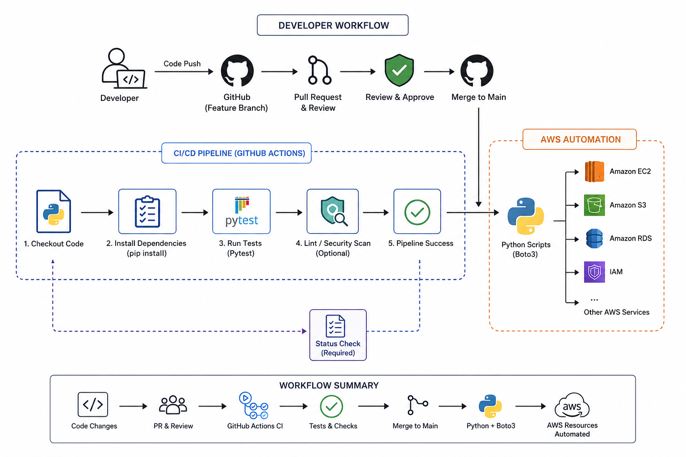

# Python AWS Automation

A Python-based AWS automation project that demonstrates how cloud infrastructure can be provisioned and managed programmatically with `boto3`, while application and infrastructure changes are protected through GitHub branch rules, pull request reviews, automated unit testing, and CI validation.

The project was created as a practical example of combining **Python automation**, **AWS SDK usage**, **GitHub Actions**, and **repository governance** in a single workflow.

---

## Project Overview

This repository demonstrates an AWS automation workflow where Python and `boto3` are used to create and manage AWS infrastructure instead of relying only on manual console operations.

The project also includes CI controls to validate changes before they are merged into the protected `main` branch.

Key capabilities include:

- AWS infrastructure automation using Python and `boto3`
- Automated unit testing with `pytest`
- Reusable GitHub Actions workflows
- Pull request validation
- Post-merge test execution
- Protected `main` branch
- Required pull request reviews
- Required status checks
- CI logs and test results available through GitHub Actions

---

## Technology Stack

| Area | Technology |
|---|---|
| Language | Python |
| AWS SDK | boto3 |
| Cloud Platform | AWS |
| CI/CD | GitHub Actions |
| Testing | pytest |
| Source Control | Git / GitHub |
| Branch Protection | GitHub Rulesets |
| Automation | Python scripts |

---

## Repository

```text
https://github.com/aasthakumarii/python-aws-automation
```

---

## Architecture

```text
Developer
   |
   v
Feature Branch
   |
   v
Pull Request
   |
   +----------------------+
   |                      |
   v                      v
Python Validation      Unit Tests
                           |
                           v
                     Required Check
                           |
                           v
                      PR Approval
                           |
                           v
                         Merge
                           |
                           v
                         main
                           |
                           v
                  Post-Merge CI Tests
                           |
                           v
                  AWS Automation Scripts
                           |
                           v
                     AWS Infrastructure
```

---

## AWS Automation with boto3

The core purpose of the project is to automate AWS infrastructure using the AWS SDK for Python.

`boto3` allows the Python application to interact directly with AWS APIs and create or manage cloud resources programmatically.

Typical automation flow:

```text
Python Script
     |
     v
boto3 Client / Resource
     |
     v
AWS API
     |
     v
Create / Configure Infrastructure
```

Example boto3 pattern:

```python
import boto3

ec2 = boto3.client("ec2")

response = ec2.describe_instances()

for reservation in response["Reservations"]:
    for instance in reservation["Instances"]:
        print(instance["InstanceId"])
```

The same pattern can be used for infrastructure provisioning, configuration, inspection, and cleanup.

---

## Why boto3?

Using `boto3` in this project demonstrates Infrastructure Automation through Python.

Benefits include:

- Repeatable infrastructure operations
- Reduced manual AWS Console work
- Scriptable provisioning
- Easier integration with CI/CD
- Better consistency between environments
- Ability to validate infrastructure logic with Python tests
- Direct use of AWS APIs

---

## AWS Authentication

The scripts should use standard AWS authentication methods.

Examples include:

```text
AWS_ACCESS_KEY_ID
AWS_SECRET_ACCESS_KEY
AWS_SESSION_TOKEN
AWS_PROFILE
IAM Role
```

Credentials must never be hardcoded in Python source files.

For local development, AWS CLI profiles can be used:

```bash
aws configure
```

Verify authentication:

```bash
aws sts get-caller-identity
```

Python can then use the configured credentials automatically:

```python
import boto3

session = boto3.Session()
sts = session.client("sts")

print(sts.get_caller_identity())
```

---

## Local Setup

Clone the repository:

```bash
git clone https://github.com/aasthakumarii/python-aws-automation.git
cd python-aws-automation
```

Create a Python virtual environment:

```bash
python -m venv .venv
```

Activate it on Windows PowerShell:

```powershell
.\.venv\Scripts\Activate.ps1
```

Activate it on Linux/macOS:

```bash
source .venv/bin/activate
```

Install dependencies:

```bash
pip install -r requirements.txt
```

---

## Running Tests

The project uses `pytest` for automated testing.

Run all tests:

```bash
pytest
```

Run with verbose output:

```bash
pytest -v
```

The CI implementation validated the project successfully with:

```text
5 tests passed
```

---

## GitHub Actions CI

The repository uses GitHub Actions for automated validation.

The CI workflow was designed to support:

- Pull request testing
- Reusable unit-test workflow
- Post-merge test execution
- Pass/fail visibility in GitHub
- Required CI status checks

Typical flow:

```text
Pull Request
     |
     v
Reusable pytest workflow
     |
     v
Run Python Unit Tests
     |
     +---- PASS ----> PR can continue
     |
     +---- FAIL ----> Merge blocked
```

After merge:

```text
Merge to main
     |
     v
Post-Merge Workflow
     |
     v
Run Unit Tests Again
     |
     v
Validate main branch
```

---

## Reusable Workflow Design

The unit testing logic is placed in a reusable GitHub Actions workflow so the same test configuration can be called from multiple workflows.

Example structure:

```text
.github/
└── workflows/
    ├── unit-tests.yml
    ├── pull-request.yml
    └── post-merge.yml
```

A caller workflow can invoke the reusable test workflow rather than duplicating test steps.

Example:

```yaml
jobs:
  unit-tests:
    uses: ./.github/workflows/unit-tests.yml
```

This improves:

- Reusability
- Maintainability
- Consistency
- Reduced workflow duplication

---

## Branch Protection

The `main` branch is protected using GitHub repository rules.

The repository was configured so changes should go through a pull request before being merged.

Controls include:

- Pull request required before merge
- Required CI status checks
- Review approval requirement
- Protected `main` branch
- Automated test validation before merge

Typical protected flow:

```text
Developer Change
      |
      v
Feature Branch
      |
      v
Pull Request
      |
      v
Unit Tests
      |
      v
Required Status Check
      |
      v
Approval
      |
      v
Merge to main
```

This protects the main branch from unvalidated changes.

---

## CI Test Result

The automated unit-test workflow was successfully validated with:

```text
5 passed
```

This confirms that the Python unit tests were successfully integrated into GitHub Actions.

---

## Example Development Workflow

Create a feature branch:

```bash
git switch -c feature/my-change
```

Make the required changes.

Run tests locally:

```bash
pytest -v
```

Commit:

```bash
git add .
git commit -m "Add AWS automation update"
```

Push:

```bash
git push -u origin feature/my-change
```

Then create a pull request:

```text
feature/my-change
        |
        v
       main
```

GitHub Actions automatically executes the required test workflow.

After successful checks and approval, the change can be merged.

---

## Suggested Repository Structure

```text
python-aws-automation/
│
├── .github/
│   └── workflows/
│       ├── unit-tests.yml
│       └── post-merge.yml
│
├── tests/
│   └── test_*.py
│
├── scripts/
│   └── aws_automation.py
│
├── requirements.txt
├── README.md
└── .gitignore
```

The exact script names may differ depending on the AWS services being automated.

---

## Security Practices

This project follows several important security practices.

| Control | Implementation |
|---|---|
| AWS credentials | External configuration / IAM |
| Secret protection | No credentials committed to Git |
| Main branch protection | GitHub Rulesets |
| Change validation | Pull requests |
| Automated tests | pytest |
| CI enforcement | GitHub Actions |
| Review process | Required approval |
| Infrastructure automation | boto3 |

---

## GitHub Secrets

If AWS credentials are required by a GitHub Actions workflow, store them under:

```text
Repository
→ Settings
→ Secrets and variables
→ Actions
```

Example secret names:

```text
AWS_ACCESS_KEY_ID
AWS_SECRET_ACCESS_KEY
AWS_REGION
```

For production-style environments, GitHub OIDC with an AWS IAM role is preferable to storing long-lived AWS access keys.

---

## CI/CD and Infrastructure Flow

```text
CODE CHANGE
     |
     v
FEATURE BRANCH
     |
     v
PULL REQUEST
     |
     +----------------+
     |                |
     v                v
PYTHON CHECKS      PYTEST
     |                |
     +-------+--------+
             |
             v
      REQUIRED CHECKS
             |
             v
          APPROVAL
             |
             v
        MERGE TO MAIN
             |
             v
      POST-MERGE TESTS
             |
             v
       PYTHON / BOTO3
             |
             v
        AWS SERVICES
```

---

## Project Goals

This project demonstrates how Python can be used not only as an application language but also as an infrastructure automation tool.

The main objectives are to show:

```text
Python
   +
boto3
   +
AWS Infrastructure
   +
Unit Testing
   +
GitHub Actions
   +
Branch Protection
```

The result is a controlled automation workflow where AWS operations are implemented through code and repository changes are protected by automated validation and review requirements.

---

## Key Outcomes

The project demonstrates:

- AWS infrastructure creation and management through `boto3`
- Python-based cloud automation
- Automated `pytest` execution
- Reusable GitHub Actions workflow design
- Pull request CI validation
- Post-merge testing
- Protected `main` branch
- Required review and status checks
- Successful execution of 5 automated tests

---

## Future Improvements

Possible future enhancements include:

- GitHub OIDC authentication to AWS
- Additional boto3 infrastructure modules
- Environment-specific configuration
- Security scanning
- Coverage reports
- HTML CI reports
- Automated infrastructure cleanup
- More unit and integration tests
- Dependency vulnerability scanning
- AWS resource tagging and compliance validation

---

## Summary

This repository is a practical demonstration of combining AWS automation and software delivery controls.

```text
Python Code
    |
    v
boto3
    |
    v
AWS Infrastructure

+

GitHub
    |
    v
Pull Request
    |
    v
Unit Tests
    |
    v
Approval
    |
    v
Protected main
```

It provides a foundation for building reliable, testable, and governed AWS automation using Python.
